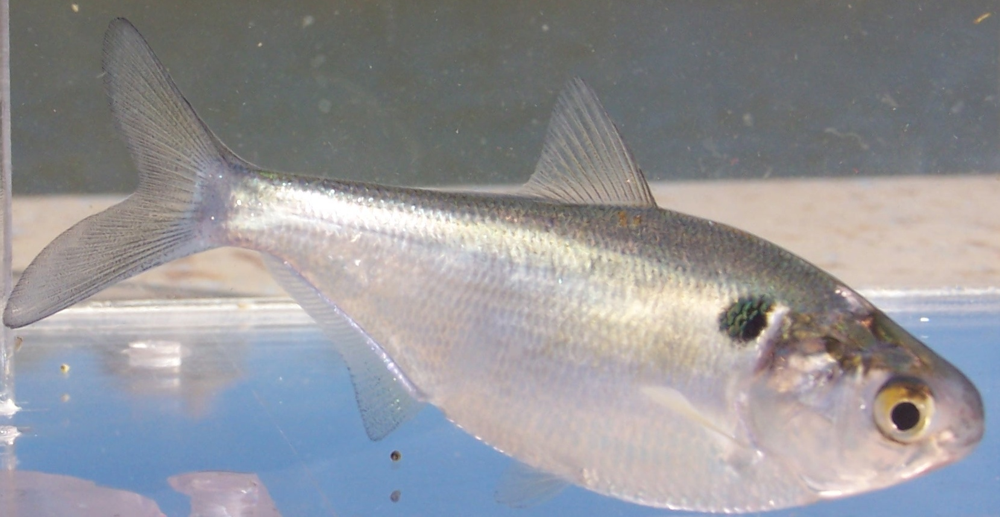

# Metabolic Ecology: How do body size and temperature affect nutrient cycling? {#sec-metabolic-ecology}

```{r}
#| label: setup
#| include: false
library(tidyverse)
library(broom)
```

::: {#fig-shad layout="[[54.4, 45.6]]"}

{#fig-shad}

{#fig-res}

Gizzard shad, *Dorosoma cepedianum*, are probably the most abundant fish (by biomass) in lakes of the southern and lower Midwest USA. They eat mud---sediment detritus from lake bottoms---and in doing so they cycle enormous quantities of nitrogen and phosphorus back into the water, fueling algal growth. In some lakes, nutrient fluxes mediated by gizzard shad support more than 25% of algal primary production. The data we use in this chapter were collected from gizzard shad at three man-made lakes (reservoirs) in Ohio, U.S.A. (Schaus et al. 1997, Higgins et al. 2006). Shad photo courtesy M.J. Vanni.
:::


## Acknowledgement
This chapter is an R version of @vanni2011meh. I am grateful to Mike and Jessica and the Ecological Society of America for making the data and the article available.

## Goals

In this chapter, you will explore how two fundamental properties of organisms---body size and temperature---control rates of nutrient cycling. Along the way, you will test specific quantitative predictions of the **Metabolic Theory of Ecology** (MTE), and discover how well those predictions hold up under real field conditions. 

If you successfully complete this chapter, you will be able to

* explain how metabolic rates scale with body size (allometry),
* explain how metabolic rates depend on temperature ($Q_{10}$),
* use log-transformations to linearize power-law relationships,
* fit and interpret linear regressions in R,
* evaluate the support for specific quantitative hypotheses, and
* reason about how body size and temperature act simultaneously on a biological rate.

## Preparatory steps

1. General background: Read the sections below on allometry and temperature dependence. If your instructor has assigned background readings or lectures on metabolic ecology, complete those first.
1. Data: go to our [class data repository](https://drive.google.com/drive/u/1/folders/1FR2FLiW3xyD4Er52YzVTToPZuXXReGRo){target="_blank"}, and download `fish_nutrient_excretion.csv`.
   a. Put `fish_nutrient_excretion.csv` in your `data` directory (inside `Rwork`).
1. Find out what you need for the deliverables (@sec-deliv-metabolic).

## Background

### The Metabolic Theory of Ecology: Why body size and temperature matter

The metabolic rates of organisms---plants, microbes, and animals---are strongly influenced by body size and body temperature [@gillooly2001est; @brown2004mte]. Large organisms obviously have higher metabolic rates than small ones, when rates are expressed on a *per individual* basis. And because biochemical reactions are temperature-dependent, most metabolic rates increase with body temperature, at least up to some upper tolerance limit.

Understanding how biological rates scale with size and temperature is important for several reasons. There is enormous variation in body size among Earth's life forms, from tiny bacteria to great whales and giant sequoia trees. Even within a single species, body size can vary dramatically. Knowledge of how rates vary with size tells us how individuals of different sizes use resources, process materials like nutrients and energy, and interact with other species. Similarly, because organisms experience a wide range of temperatures---both naturally and increasingly due to human activity---understanding temperature effects helps us predict how organisms and ecosystems may respond to environmental change.

The **Metabolic Theory of Ecology** (MTE) provides mechanistic explanations for these relationships [@west1997gmo;  @brown2004mte; @banavar2014ffe]. The theory describes how diffusion and diffusion networks in an individual organism cause body size alone to exert a strong and predictable effect on whole-organism metabolic rate. This theory also describes how the temperature regulation of biochemical processes at the molecular level has a similarly profound and predictable influence on whole-organism metabolic rate. Notably, and in contrast to most ecological theory, MTE makes predictions about the quantitative effects of body size and temperature metabolic rate.

At the base of all the explanation is the geometry of the resource distribution system (vascular system, simple 3D diffusion). All organisms take in limiting resources and have to distribute those resources to each part of each cell in the body. The key point is that *the larger the organism, the greater the portion of the resources are in transit at any instant in time*. This leads to an increasingly inefficient system, in which the metabolism of larger organisms has to run more slowly per unit resource:


### Allometry: how rates scale with body size

At a constant temperature, the effect of body size on metabolic rate can be described with a simple power law:

$$B = B_0 M^z$$ {#eq-allometry}

where $B$ is the organism's metabolic rate (e.g., micromoles of nitrogen excreted per hour), $B_0$ is a normalization constant, $z$ is the **allometric scaling exponent**, and $M$ is the organism's body mass.

::: {.callout-note icon=false}
## Follow the Logic: Why log-transform?

@eq-allometry is a *power law*---the dependent variable ($B$) is a power function of the independent variable ($M$). Power laws are curved on arithmetic axes, which makes them hard to interpret visually and statistically. But watch what happens when we take the logarithm of both sides:

$$\log B = \log B_0 + z \cdot \log M$$ {#eq-allometry-log}

This is the equation of a straight line! The slope is $z$ (the allometric exponent) and the intercept is $\log B_0$. This is why ecologists plot metabolic data on log-log axes: it turns a curved relationship into a linear one, and the slope tells us directly how metabolic rate scales with body size.

This is a case where the mathematics *is* the ecological reasoning. The log-transformation isn't just a trick to make a pretty graph---it reveals the fundamental scaling relationship and lets us estimate the parameter ($z$) that captures how biology works.
:::

Allometric theory and extensive empirical data show that for many biological rates, the increase in metabolic rate is less than proportional to the increase in body mass. Mathematically, this means $b < 1$, sometimes called **negative allometry**. The **Metabolic Theory of Ecology** (MTE) makes a very specific prediction: $b = 0.75$ [@west1997gmo;  @brown2004mte; @banavar2014ffe]. This prediction arises from theory about how resource distribution networks (like circulatory systems) scale with body size.

To get a feel for why $b < 1$ matters, consider this: an elephant ($5 \times 10^6$ g) weighs about 500,000 times more than a mouse (10 g). If $b = 0.75$, the elephant's metabolic rate is only about 19,000 times greater than the mouse's---proportionally much less than the difference in body mass. Per gram, the mouse burns hotter.

Thus, Larger organisms can process more resources per unit time ($B=aM^{3/4}$), but do so less and less efficiently ($\frac{B}{M}=aM^{-1/4}$) due to resources in transport.

However, the prediction that $b = 0.75$ is somewhat controversial. Some data suggest that the exponent is closer to 1.0 for many organisms [e.g., @reich2006usr], and others argue that $b \approx 0.75$ only when averaged across many species but varies considerably among them [@isaac2010wam].

### Temperature dependence and the Arrhenius Equation

In addition to the role of body size, MTE incorporates the effects of temperature. @gillooly2001est showed that metabolic rate can be predicted from both body mass and body temperature:

$$B = B_0 M^z e^{-E_a/(kT)}$$ {#eq-mte-full}

where $e$ is the base of the natural logarithm, $Ea$ is the activation energy of metabolic enzymes, $k$ is Boltzmann's constant ($8.617 \times 10^{-5}$ eV K$^{-1}$), and $T$ is temperature in Kelvin.^[Recall Kelvin degrees = Celsius degrees + 273.15] 

In the late 1800s, Svante Arrhenius described the power law relation for the temperature dependence of chemical reaction rates; you may have encountered this in your chemistry class. This was further quantified and explained using first principles of entropy and probability by Ludwig Boltzmann.^[Boltzmann's work on this and on *entropy* have connections throughout science, including Planck's constant and blackbody radiation, and even the meaning of time.] Boltzmann showed how the emergent property of "temperature" emerges from the thermal energy of individual particles. Later, Max Planck further explicated this quantity, referring to the specific quantity as $k$, and then named it after Boltzmann. You will also encounter Boltzmann's constant in our last chapter, on global heating.


### Nutrient excretion by fish

Most experimental tests of MTE have been done in the lab, where activity, temperature, and diet can be controlled and we can measure *basal metabolic rate* (i.e. base metabolic rate, at rest). But organisms in nature are often active, experience variable temperatures, and are feeding---they display *active metabolic rates.* Far fewer studies have tested whether MTE predictions hold under field conditions, where diet, activity, and other factors add noise.

Excretion rate is a type of whole-organism metabolic rate. It is an output of many metabolic processes, and it represents the quantity of nutrient released after maintenance and growth needs are met. 

This output from the metabolic processes of many individuals has important consequences [@sterner2002esb]. This excretion of nitrogen (N) and phosphorus (P) by fish is ecologically important because these nutrients, released in dissolved form that algae can readily use, can fuel a significant fraction of primary production in lakes [@vanni2006ncf].

## Using logarithms
It is common to express these relationships on a logarithmic scale, and we do this for two reasons. First, it expresses the relations on a relative in which multiplicative differences are shown as additive and our brains can understand additive differences more eaasily. Second, using a logarithmic scale linearizes the relations and allows us to more easily estimate the parameters of interest: $z$ (allometric scaling) and $E_a$ (temperature sensitivity).

Taking the logarithms of @eq-mte-full, we have
$$\ln (B) = \ln (B_0) + z \ln (M) - E_a \frac{1}{kT}$$

where $k$ is Boltzmann's constant and $T$ is temperature in degrees Kelvin. Below, we will start with the raw data and create new variables of $\ln (B)$, $\ln (M)$, and $1/(kT)$.


## Hypotheses, our data, and predictions

Once we know what data we have available to us, we can use our hypotheses to make specific predictions about those data. Remember that a *scientific hypothesis* should be a general explanation of a process or pattern in nature, anbd *prediction* is a logical deduction that follows when we apply that general explanation to a particular system.^[Recall that a *scientific theory* is a very strongly supported and even more general set of explanations that provides framework to organize our well-supported ideas and helps us generate new hypotheses.]

So, logic follows in this manner:

The MTE describes the ecological consequences of body size and temperature. Given that theory, we can hypothesize that 
1. because the metabolic rate of larger bodied organisms scale to the 3/4 power of size, fish nutrient excretion rate should also scale in the same manner; and
1. because the metabolic rate of warmer organisms scale with temperature by a factor of $E_a/(kT)$ where $E_a \approx 0.23$, fish nutrient excretion rate should also scale in the same manner.

What data do we have?

The data we will analyze come from field studies of nutrient excretion by gizzard shad (*Dorosoma cepedianum*) in three Ohio lakes [@schaus1997npe; @higgins2006dsn](@fig-res). We have excretion data for 200 individual fish. These 200 fish are a tiny fraction of the fish in these lakes, but they represent a useful sample from which we can extrapolate. 

Individual fish were captured, placed in filtered lake water, and investigators measured the change in (i) dissolved N and (ii) P concentration over a fixed period of time. The variables in the data set are:

* `temp_C` --- water temperature (°C) experienced by the fish
* `mass_g` --- wet body mass (grams)
* `N_u.h` --- nitrogen excretion rate ($\mu$mol N per fish per hour)
* `P_u.h` --- phosphorus excretion rate ($\mu$mol P per fish per hour)

### Predictions

**Given our hypotheses and the data we have, we *predict* that gizzard shad nutrient excretion rate will scale with the 3/4 power of gizzard shad body mass, and by a factor of by a factor of $E_a$ with the inverse of temperature $1/T$.**

**You will use multiple linear regression to evaluate those predictions.**

## Getting R ready for work

Open R using RStudio, and load the packages we'll need. Note that we will use a new package, `broom`. You will need to install `broom` if you hadn't done so for some other exercise or your own research.

To install `broom`, you can use the *Tools* drop-down menu in RStudio, or run this code:
```{r}
#| eval: false
install.packages("broom")
```

Now load `broom`, and `tidyverse` if you have not already done so.
```{r}
#| eval: false
library(tidyverse)
library(broom)
```

Now read in the data and take a look.

```{r}
# Note we skip the first 8 lines because they are 'metadata',
# which is 'data about data` or information about the variables.

fish <- read.csv("data/fish_nutrient_excretion.csv", skip=8)
glimpse(fish)
```

```{r}
summary(fish)
```

You should have 200 rows and 5 columns. The fish range in mass from about 2 g to over 200 g, and temperatures range from about 16°C to 29°C.

What are 16°C to 29°C in Fahrenheit degrees? (The conversion factor is $Y^\circ\, \mathrm(F) =  \frac{180}{100} X^\circ\, \mathrm{C} + 32$)

## Exploring the data

We already know that we will want to create a few new variables based on the raw data, including the logs of excretion rates, mass and the inverse of temperature in Kelvin. Below we do that.

First, here is the value of Boltzmann's constant, in units of electron volts per degree Kelvin
```{r}
boltzmann_k <- 8.617333262e-5
```

Now we transform our variables.
```{r}
## Add log-transformed columns to the data
fish <- fish %>% #start with our fish data set, and
  mutate(log_mass = log(mass_g), # create ln(mass)
         log_N = log(N_u.h), # ln(N excretion)
         log_P = log(P_u.h), # ln(P excretion)
         temp_K = 273.15 + temp_C, # degrees Kelvin
         inv.kT = 1/(boltzmann_k * temp_K) # inverse scaled Kelvin
  )
         
```

Before testing any hypotheses, let's look at the data. Always plot your data before you analyze it.

### Raw-scale plots

```{r}
#| label: fig-raw-N
#| fig-cap: "Nitrogen excretion rate vs. body mass on arithmetic (raw) axes."
ggplot(fish, aes(x = mass_g, y = N_u.h)) +
  geom_point(alpha = 0.5) +
  labs(x = "Body mass (g)",
       y = expression(paste("N excretion (", mu, "mol ", fish^{-1}, " ", hr^{-1}, ")")),
       title = "N excretion vs. body mass") +
  theme_minimal()
```

Make a similar plot for P excretion rate. What do you notice about the shape of these relationships? They are curved---larger fish excrete more, but the relationship is not a straight line.

### Log-transformed plots

Now let's see what happens when we log-transform both axes, as suggested by the allometric equation (@eq-allometry-log).

```{r}
#| label: fig-log-N
#| fig-cap: "Log nitrogen excretion rate vs. log body mass. If the allometric model holds, this should be approximately linear."
ggplot(fish, aes(x = log(mass_g), y = log(N_u.h))) +
  geom_point(alpha = 0.5) +
  labs(x = expression(log[10]~"(body mass, g)"),
       y = expression(log[10]~"(N excretion, " * mu * "mol " * fish^{-1} * " " * hr^{-1} * ")"),
       title = "Allometric scaling of N excretion") +
  theme_minimal()
```

That looks much more linear! The log-transformation did exactly what @eq-allometry-log predicted. Make the same plot for P excretion.

MTE also suggests that temperature might influence excretion rates. Here we plot separate rate vs. mass graphs for each temperature:
 
```{r}
#| label: fig-regression-N1
#| fig-cap: "Linear regression of log N excretion on log body mass, for each temperature."
ggplot(fish, aes(x = log_mass, y = log_N)) +
  geom_point(alpha = 0.5) +
  geom_smooth(method = "lm", se = TRUE) +
  facet_wrap(~temp_C) + 
  labs(x = expression(log~"(body mass, g)"),
       y = expression(log~"(N excretion)"),
       title = "Allometric scaling of N excretion") +
  theme_minimal()
```

### Allometric and temperature scaling of excretion rates {#sec-assign1}

Here you need to estimate the allometric scaling exponent ($z$) and the energy of activation (aka temperature sensitivity) for both N and P excretion rates. Multiple regression will let us address a key question how we can how do you deal with the fact that excretion rates were measured at different temperatures?

There is more than one reasonable approach. Think about this before reading on. One approach is to pool all the data together and fit a single multiple regression. Another is to fit separate regressions for each temperature and then compare slopes. You could try both and think about what you learn from each approach.

#### Mulltiple linear regression

Now fit a linear regression for log N excretion vs. log mass and inverse temperature.

```{r}
## Fit the regression
m_N_all <- lm(log_N ~ log_mass + inv.kT, data = fish)
```
If it ran without error, you are ready for the next step.

**Next step: check your assumptions**

All statistical models have builit-in assumptions. The regression we ran here assumes, among other things, that the relationships are linear and the unexplained noise in the data are normally distributed, both above and below the expected or fitted values. Here we examin that graphically.
```{r}
plot(m_N_all, which=1)
```

If these assumptions are met, then the *residual* unexplained noise is just as likely to be positive and negative for any fitted value. And that is essentially what we see. Thus these assumptions appear to be met.

#### Evaluating the predictions

Recall that our equation is now 

$$\ln (B) = \ln (B_0) + z \ln (M) - E_a \frac{1}{kT}$$
and our regression will estimate $z$ for log mass, and $E_a$ for inverse scaled temperature. Here are the 95% *confidence intervals* on those. 

A *confidence interval* (CI) is essentially a *procedure*, rather than a thing. A 95% CI is a procedure wherein if you repeated the experiment many, many times, the CIs would capture the true estimate about 95% of the time.

Here are the confidence intervals for $z$ (for log mass) and $E_a$ (for inverse scaled temperature).
```{r}
## View the results
# ignore the intercept
confint(m_N_all)
```

#### **Do the same** for P excretion. 


```{r}
#| echo: false
#| eval: false
fish <- fish %>%
  mutate(
    log_mass_groups = cut_number(log_mass, 6)
  )
ggplot(fish, aes(x = inv.kT, y = log_N)) +
  geom_point(alpha = 0.5) +
  geom_smooth(method = "lm", se = TRUE) +
  facet_wrap(~log_mass_groups, scales="free")
  labs(x = expression(log[10]~"(body mass, g)"),
       y = expression(log[10]~"(N excretion)"),
       title = "Allometric scaling of N excretion") +
  theme_minimal()
```


### Thinking bigger: ecosystem consequences

We have focused on excretion by individual fish. But remember the bigger picture (@fig-shad): gizzard shad are extremely abundant in many Midwestern lakes. They consume sediment detritus, extract what they need, and excrete the rest as dissolved N and P that algae can immediately use.

Consider this: if you know the allometric scaling exponent and $E_a$, and you know the size distribution and temperature regime of a lake, you could *predict* the total nutrient flux from the fish population to the water column. This is exactly the kind of scaling-up that makes metabolic ecology so powerful---and so important for understanding ecosystem function.

Think about the following:

1. Suppose a lake warms by 2°C due to climate change. Based on your $E_a$ estimate, by how much would individual excretion rates change?
2. If warming also shifts the fish population toward smaller body sizes (as has been observed in some systems), how would that interact with the temperature effect on total nutrient flux?

These are the kinds of questions where mathematical reasoning, ecological knowledge, and careful quantitative thinking all come together.


## Deliverables {#sec-deliv-metabolic}

Compile the following into one document and submit by the due date. Turn in a Word document or PDF with the following:

1. Log-log scatter plots of N and P excretion vs. body mass for each temperature.
1. Confidence intervals of the allometric scaling exponent ($z$) for both N and P excretion.
1. A statement of whether the data support MTE's prediction of $b = 0.75$ and $E_a = 0.23$. Overall, how well do the predictions of the Metabolic Theory of Ecology hold up for nutrient excretion by fish under field conditions? What specific factor or factors might cause deviations from MTE predictions in the field?
